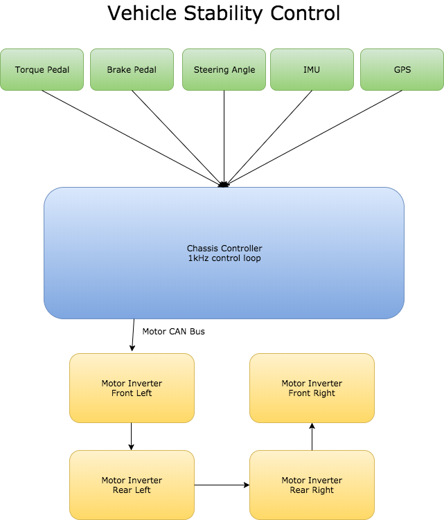

# QUT Motorsport - Chassis Controller

### What
What is the system
### Why
Why is it there, what's its main purpose
### How
How does it work, interact with other systems, what's it responding to, what's it enacting on
### Where
Where does it sit in the grand scheme of things, what's its heirachy, where is it physically in the car
### Who
Who are the people that have worked on it over time

## Specific README's
These will cover any specific features, outlines or documentation that a programmer/designer should know about. Any specifics, or this outside the overview/outline please update an entry in the wiki

[Hardware](https://github.com/Technosasquach/QUTMS_ChassisController/tree/master/hardware "Hardware")

[Software](https://github.com/Technosasquach/QUTMS_ChassisController/tree/master/software "Software")

## System

This link is for the UART comms, it may be updated in the future to include the CANBUS system. This document specs out the UART interface that the chassis controller will be using to communicate to the Configuration Software.
[QUTMS_UART_Packet_Def](https://docs.google.com/spreadsheets/d/1M0LFDXtBvufXvVOvwZmF34SnBRF86Ai6lYGNQQMeDdA/edit?usp=sharing "QUTMS_UART_Packet_Def")

The following is an early rough diagram

